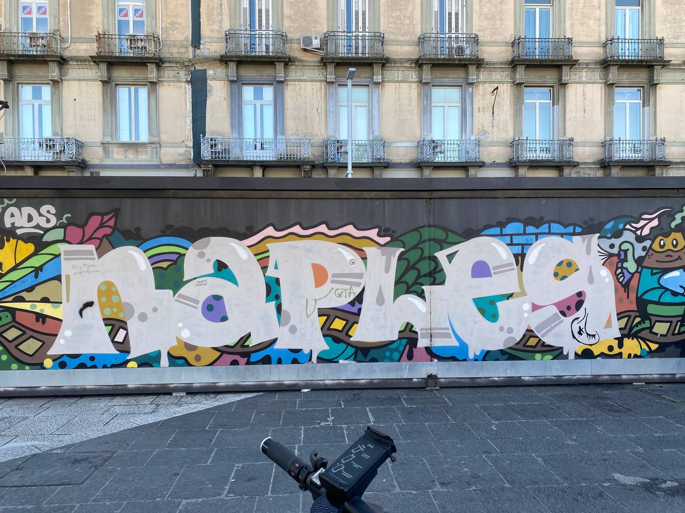
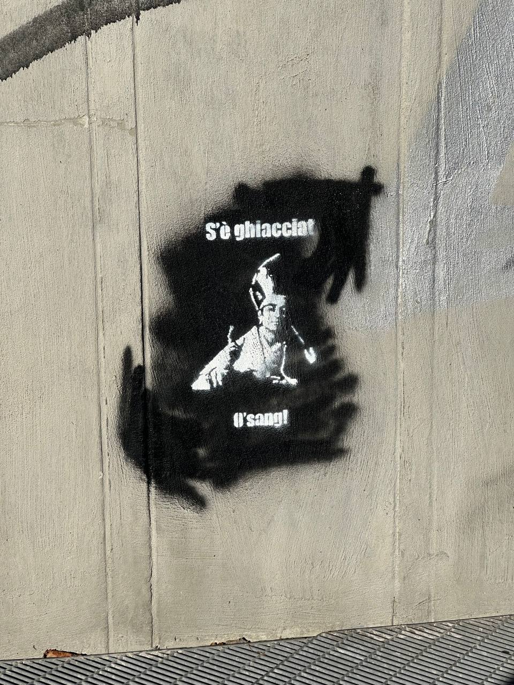
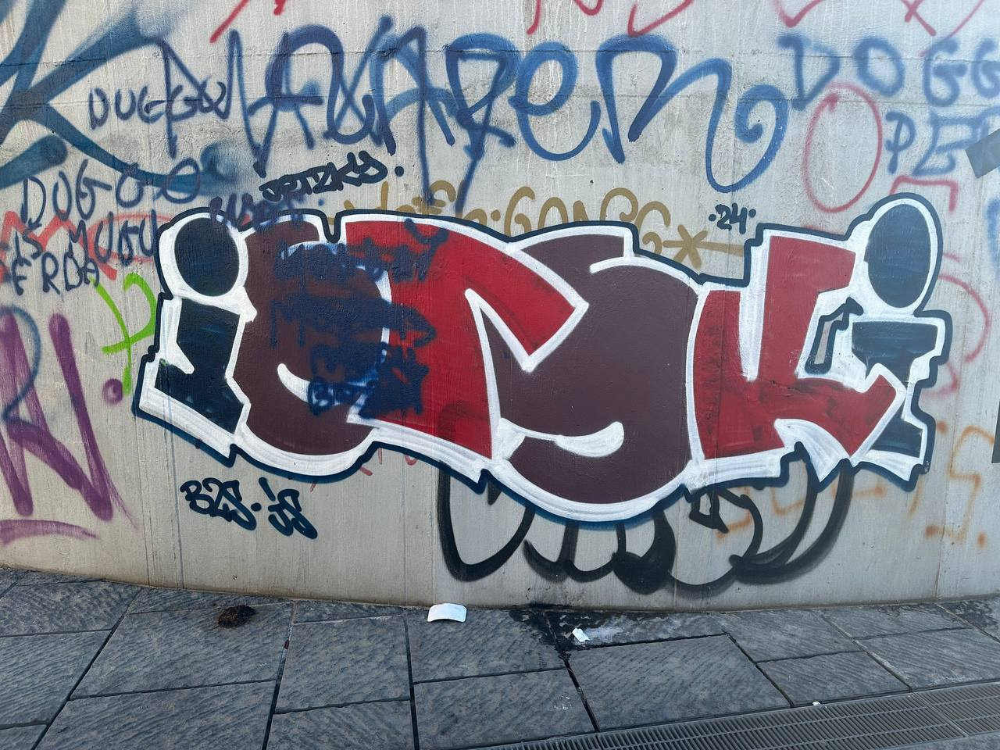
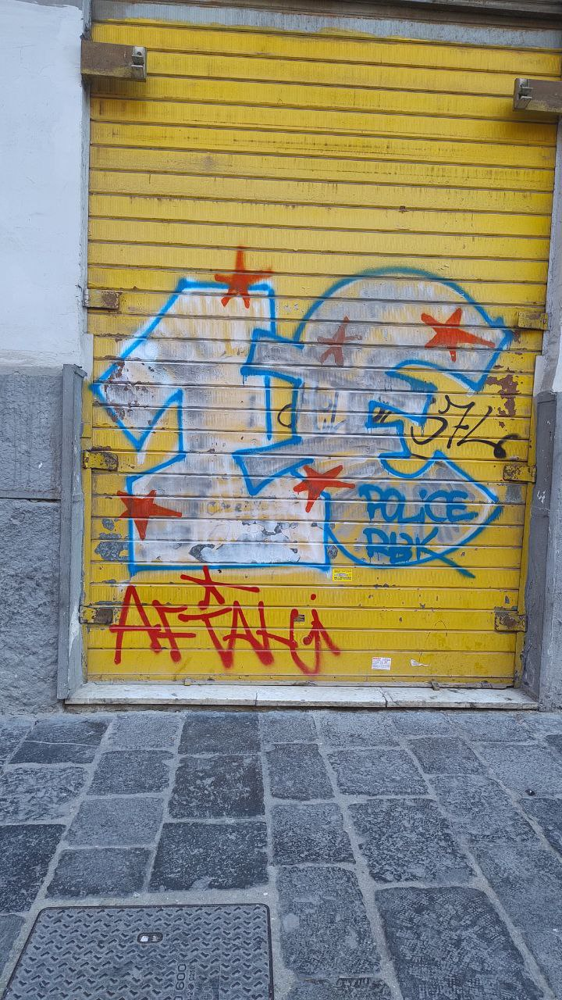
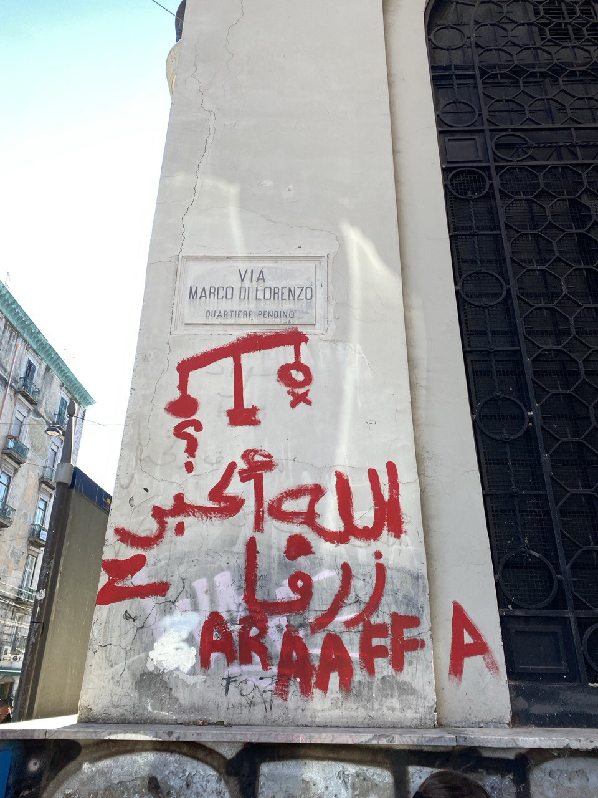
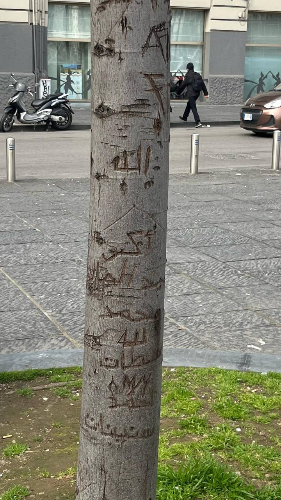
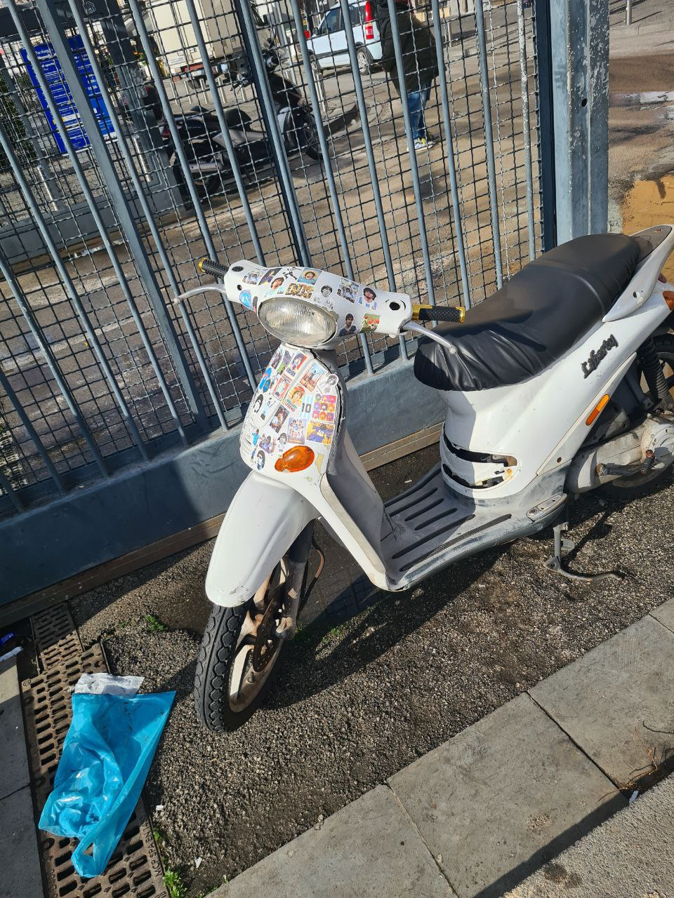
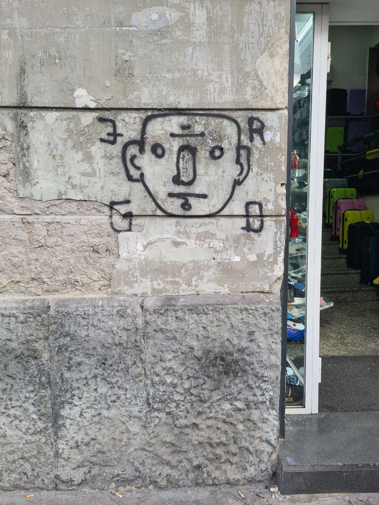
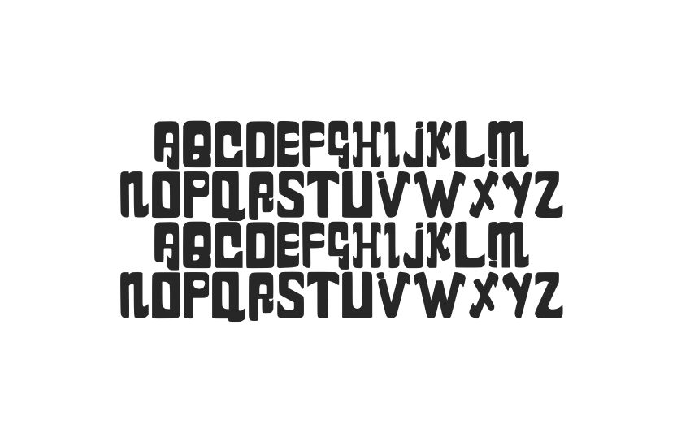

# Gruppo Lettering

  

Durante il progetto, ho avuto l’opportunità di far parte del gruppo dedicato al **lettering**, un'esperienza che mi ha permesso di guardare Piazza Garibaldi con occhi nuovi. In un luogo così carico di passaggi, storie e contrasti, la ricerca delle scritte, dei segni e dei murales presenti nei suoi spazi è diventata per me un vero e proprio esercizio di **osservazione** e ascolto del territorio.

Nel corso delle esplorazioni, ho raccolto **numerose fotografie**: murales sbiaditi, scritte spontanee sui muri, insegne dimenticate, tag e messaggi effimeri. Ognuno di questi elementi raccontava qualcosa della piazza e delle persone che la vivono. Ho deciso di inserire tutto questo materiale nella mia documentazione, perché credo che custodisca una **memoria visiva importante e sincera**.

<strong>📸 Scorri verso destra per vedere tutte le immagini del progetto.</strong>

  
  
  
  
  
  
  

Queste immagini documentano lettere ritrovate nei luoghi più inaspettati: muri scrostati, serrande, insegne dismesse, scritte a pennarello o spray. Ciascuna foto cattura un diverso approccio al segno: alcune lettere sono calligrafiche, altre spigolose e irregolari, altre ancora sembrano nate dal caso. Ma tutte parlano.
Queste scritte sono **gesti di presenza**. Rappresentano la voce di chi, forse, non ha altri modi per farsi sentire: ragazzi, migranti, cittadini invisibili, giovani in protesta o semplicemente in cerca di uno spazio. Sono *atti di esistenza*, piccole ribellioni contro l’anonimato della città.

Moralmente, molte di queste scritte raccontano un bisogno urgente: **essere visti, essere ascoltati.** Alcune sono provocatorie, altre intime, altre ancora ironiche o disperate. In ogni caso, tutte dicono: "Io ci sono."

Questa ricerca non si è fermata alla semplice raccolta: analizzando i caratteri tipografici emersi dal contesto urbano, **abbiamo addirittura sviluppato un font**. Un carattere che nasce dalla piazza, ne porta le tracce, e restituisce la sua voce attraverso le lettere. È stato emozionante trasformare ciò che sembrava solo “rumore visivo” in **un linguaggio grafico coerente e originale**.

  

  <strong>Scarica il font Garibalds:</strong> 
  <a href="../../files/Garibalds-Bold.otf" download>
    📥 Clicca qui per scaricare il file
  </a>

Attraverso il **lettering**, Piazza Garibaldi mi è sembrata meno caotica e più viva, quasi volesse parlare davvero. Questo lavoro mi ha insegnato che anche ciò che spesso passa inosservato – **una scritta sbiadita, una parola tracciata in fretta** – può avere un significato, una forma, un valore. E io, in questo processo, **ho scoperto un modo più profondo e personale di leggere la città**.
