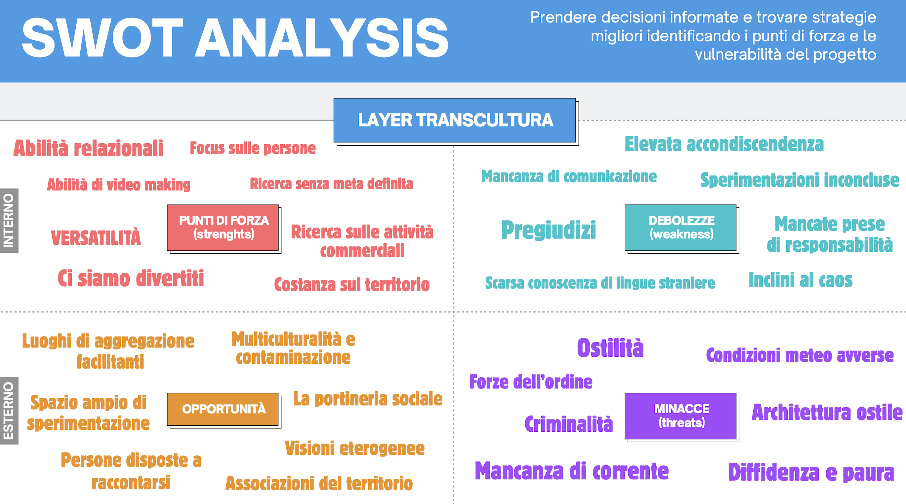
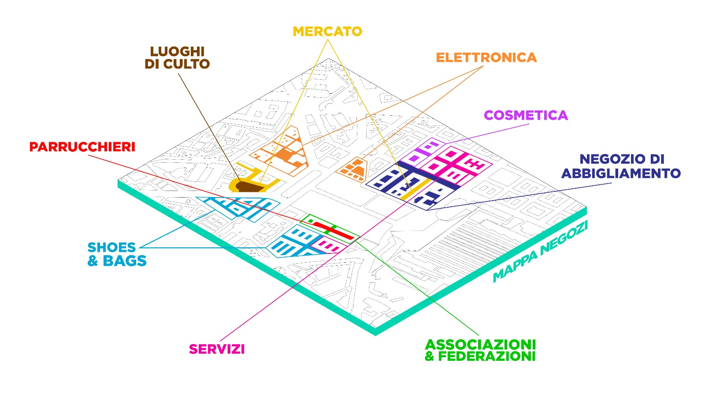
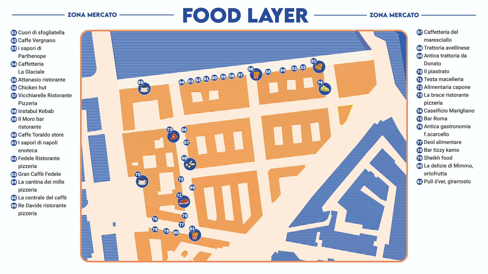

Il **gruppo Transcultura** nasce quasi naturalmente, come prosecuzione e trasformazione dell’esperienza del gruppo **Lettering**. Dopo aver osservato attentamente i segni visivi della piazza, ci siamo accorti che dietro ogni scritta, ogni colore, ogni gesto urbano, si nascondevano presenze, identità, **culture**. Da qui è nato il nostro desiderio: esplorare la dimensione umana e **multiculturale** di Piazza Garibaldi, quella fatta di vite vissute, di passaggi silenziosi, di **storie mai raccontate**.

Nei nostri primi attraversamenti ci siamo lasciati interrogare dalla piazza: da chi la abita, da chi la attraversa ogni giorno, da chi vi lavora. Abbiamo capito che non si trattava solo di osservare, ma di mettere in discussione anche i nostri stessi sguardi, spesso condizionati da **pregiudizi invisibili**.

Con questa consapevolezza è iniziato un lavoro più profondo: abbiamo ascoltato, parlato, osservato con attenzione, cercando di cogliere quello che spesso sfugge. Piazza Garibaldi è una realtà stratificata, piena di contrasti ma anche di incontri possibili. È una piazza che **racconta il mondo**.

Una parte importante del nostro percorso è stato il **censimento del territorio**, in particolare delle attività commerciali.

  

Mappando i negozi, le botteghe, i mercatini, abbiamo scoperto che Piazza Garibaldi è una **geografia del cibo**, un luogo dove le culture si incontrano non solo attraverso le lingue o i gesti, ma soprattutto attraverso i sapori. Il cibo si è rivelato un linguaggio comune, un modo per **raccontare la propria terra**, la propria **storia**, anche lontano da casa.

  

Parallelamente, abbiamo avviato una **ricerca dermografica**, ispirandoci al progetto [**Humanae**](https://www.angelicadass.com/humanae), per riflettere sull’identità attraverso il colore della pelle. Abbiamo scattato oltre cento fotografie in laboratorio, cercando di restituire, con rispetto e neutralità, la ricchezza della diversità umana che anima la piazza. Da questo lavoro è nato un mosaico fatto di campioni di pelle, un **tentativo visivo** di rappresentare ciò che le parole a volte non sanno dire.

  <video width="600" controls autoplay loop muted>
    <source src="../clip.MP4" type="video/MP4">
    Il tuo browser non supporta il tag video.
  </video>

Le **immagini raccolte** durante questo percorso — tra volti, colori, spazi condivisi e oggetti del quotidiano — parlano da sole. Sono tracce di un'esperienza collettiva, frammenti di un'indagine che ha voluto mettere al centro le persone, le differenze, ma anche le possibilità di incontro. Con Transcultura non abbiamo cercato risposte facili, ma abbiamo imparato a stare dentro la complessità, ad ascoltarla e restituirla, con **rispetto**, nella forma più sincera che avevamo a disposizione: la **narrazione**.
